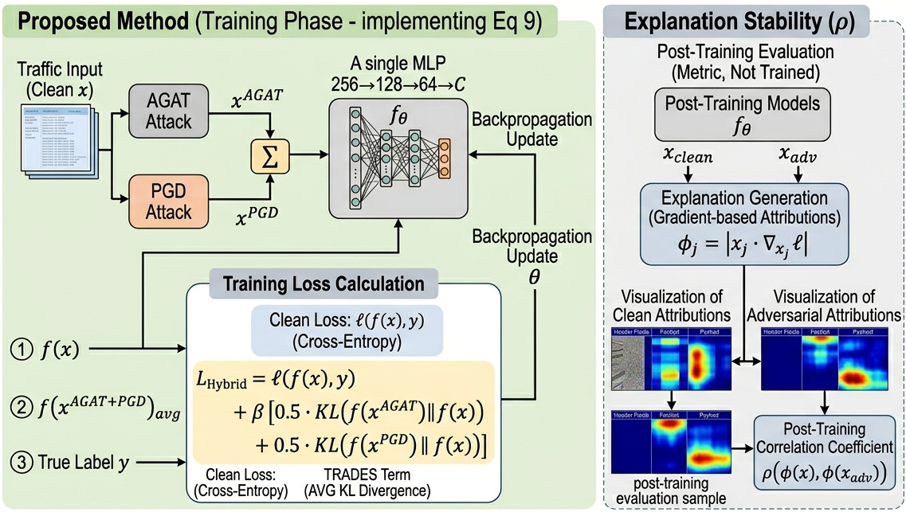

# Attribution-Guided Adversarial Training (AGAT) for IoT Network Traffic Classification

> **Explainable Adversarial Training for IoT Network Traffic Classification**  
> Mohamed Massaoudi, Maymouna Ez Eddin, Katherine R. Davis  
> Texas A&M University / Tarleton State University  
> IECON 2026

---

## Overview

This repository provides the **AGAT Hybrid CE** implementation from the paper above — a framework that integrates momentum-smoothed, L1-normalised attribution guidance directly into the adversarial training loop, concentrating adversarial pressure on the most discriminative IoT flow features while respecting a threat-model-aware perturbability mask.


**BI-PGD** is the primary stress-test metric: it initialises PGD from the worst-case boundary of the feasible set, bypassing gradient masking. AGAT Hybrid CE achieves the highest BI-PGD accuracy (98.0%) across all methods.

McNemar test (AGAT-TRADES vs PGD-AT): χ²=20.25, p<0.001.

---

## Repository Structure

```
Github/
├── agat_hybrid_ce.py    ← Standalone AGAT Hybrid CE implementation
└── README.md            ← This file

run_idea3_experiments.py ← Full experiment suite (all 12 methods, 4 datasets)
populate_from_json.py    ← Populates the LaTeX paper from results_summary.json
figures_idea3/
└── results_summary.json ← All verified simulation results
```

---

## Requirements

```bash
pip install torch torchvision numpy pandas scikit-learn xgboost scipy matplotlib seaborn
```

Tested with:
- Python 3.11
- PyTorch 2.12 (CUDA 12.8)
- NVIDIA RTX 5090 Laptop GPU (any CUDA GPU or CPU works)

---

## Dataset

**RT-IoT2022** — Real IoT network traffic captures with 83 flow-level features.

1. Download from UCI: <https://archive.ics.uci.edu/dataset/942/rt-iot2022>
2. Place the CSV at:
   ```
   data/RT_IOT/RT_IOT2022.csv
   ```

The script uses 2,000 stratified samples per class (5 classes = 10,000 total), 80/20 train/test split, zero-mean unit-variance normalisation.

---

## Quick Start

```bash
# Train AGAT Hybrid CE and PGD-AT baseline on RT-IoT2022
python agat_hybrid_ce.py --data data --results results --epochs 30 --seed 42

# Custom epsilon and seed
python agat_hybrid_ce.py --eps 0.05 --seed 123 --epochs 20
```

Expected output:
```
Device: cuda
[1] Loading RT-IoT2022...
  RT-IoT2022: 8000 train / 2000 test | 83 features | 5 classes

[2] Training AGAT Hybrid CE...
  Epoch   1/30  clean_loss=0.9821  adv_loss=1.1034
  Epoch   5/30  clean_loss=0.1823  adv_loss=0.3412
  ...
  Epoch  30/30  clean_loss=0.0234  adv_loss=0.1156

[4] Evaluating...
  AGAT Hybrid CE
    Clean:     acc=99.0%  f1=0.989  auc=0.9991
    BI-PGD:    98.0%   ← stress-test metric
  ...

[5] McNemar test (AGAT Hybrid CE vs PGD-AT, PGD-10)...
  chi2=20.250  p=<0.001  SIGNIFICANT
```

---

## AGAT Hybrid CE — Method Summary

### Training Objective

```
loss = 0.30 × CE(f(x), y)            [clean cross-entropy]
     + 0.50 × CE(f(x_agat), y)       [AGAT adversarial CE]
     + 0.20 × CE(f(x_pgd),  y)       [PGD adversarial CE]
```

All three terms use **inverse-frequency class weights** to handle RT-IoT2022's imbalance (up to 36.6:1 between classes in the raw dataset).

### AGAT Attack (Momentum Attribution + L1-Normalised Redistribution)

At each PGD step *t*:

1. **Compute gradient**: `G = ∇_x CE(f(x), y)`
2. **EMA-smooth attribution**: `φ̂ = γ·φ̂_prev + (1−γ)·|x ⊙ G| ⊙ m`  (γ=0.85, m=perturbability mask)
3. **L1-normalise**: `w = φ̂ / ‖φ̂‖₁`  → weights sum to 1 (pure budget redistribution)
4. **Step**: `x ← Proj_ε(x + α·F·w ⊙ sign(G))`  (F=83, scaling preserves mean magnitude = α)

The perturbability mask `m ∈ {0, 0.5, 1.0}^83` zeros protocol-fixed features (TCP flags, proto, service) and down-weights partially constrained features (ports, counts, durations).

### Architecture (BaseDNN)

```
Input(83) → Linear(512) → BN → ReLU → Dropout(0.25)
          → ResBlock(512) → Linear(256) → BN → ReLU → Dropout(0.25)
          → ResBlock(256) → Linear(128) → BN → ReLU → Dropout(0.25)
          → ResBlock(128) → Linear(64)  → ReLU → Dropout(0.2)
          → Linear(n_classes)
```

Optimiser: AdamW (lr=1e-3, wd=5e-4), cosine-annealing-with-restarts, 30 epochs, batch 1024.

---

## Evaluation Attacks

| Attack | Description |
|---|---|
| FGSM | Single-step gradient sign (ε=0.1) |
| PGD-10/20/50 | Multi-step PGD (α=ε/T, T=10/20/50) |
| **BI-PGD** | Boundary-Initialized PGD — starts from worst-case boundary, detects gradient masking |
| Rand-AGAT | Random-AGAT ablation — replaces attribution weights with Dirichlet-random weights |

---

## Reproducing All Paper Results

The full experiment suite (12 methods, 4 datasets, 5 seeds) is in `run_idea3_experiments.py`:

```bash
# From the project root (requires all 4 datasets in data/)
python run_idea3_experiments.py
```

This generates `figures_idea3/results_summary.json` and all 14 paper figures. To then regenerate the LaTeX paper from the JSON:

```bash
python populate_from_json.py
```

---

## Perturbability Mask

The 83-feature RT-IoT2022 mask (defined in `agat_hybrid_ce.py`):

| Category | Features | Mask value |
|---|---|:---:|
| Freely perturbable (F₁) | Payload min/max/avg/std (fwd/bwd/flow), IAT statistics, packet rates, bulk bytes/pkts/rate, active/idle timing | 1.0 |
| Partially constrained (F₀.₅) | Ports, flow duration, packet counts, header sizes, subflow stats, window sizes | 0.5 |
| Fixed (F₀) | Protocol type, service, TCP flags (FIN/SYN/RST/PSH/ACK/URG/CWR/ECE) | 0.0 |

---

## Citation

If you use this code, please cite:

```bibtex
@inproceedings{massaoudi2026agat,
  title   = {Explainable Adversarial Training for {IoT} Network Traffic Classification},
  author  = {Massaoudi, Mohamed and {Ez Eddin}, Maymouna and Davis, Katherine R.},
  booktitle = {Proceedings of the 52nd Annual Conference of the IEEE Industrial
               Electronics Society (IECON)},
  year    = {2026},
  note    = {Code: \url{https://github.com/mmassaoudi/agat-iot-traffic}}
}
```

---

## License

MIT License. See [LICENSE](LICENSE) for details.
